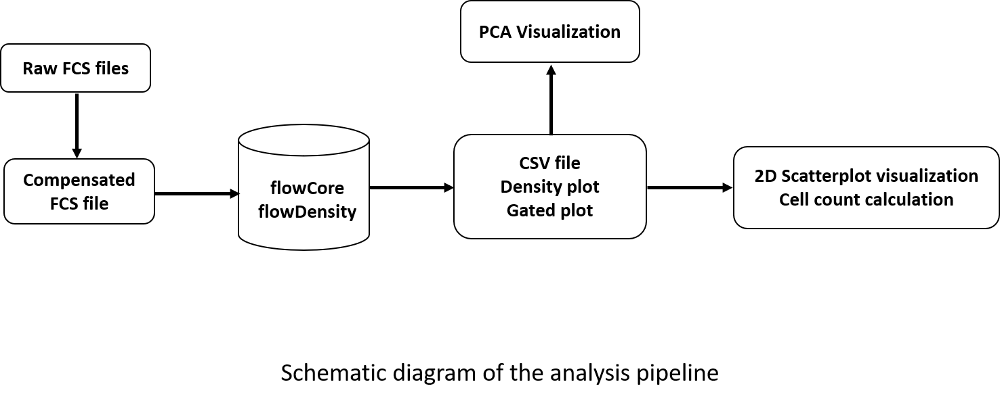

# Flow Cytometry Data Analysis and Visualization Pipeline using flowDensity

## Usage:
1. The directory is divided into three groups - data, scripts, and result.
   data directory contains fcs files for different cell types.
   result directory contains the output of the program in respective cell type folder.

2. The pipeline consists of -
  step 1: run flowDensity with optimized parameters with parental gating
  step 2: run flowDensity with optimized parameters for comprehensive expression analysis
  step 3: PCA visualization
  step 4: Comprehensive expression analysis visualization

## Example
  bash runFlowDensityAnalysis.sh -t Tcells-Bcells-CD34cells
  
